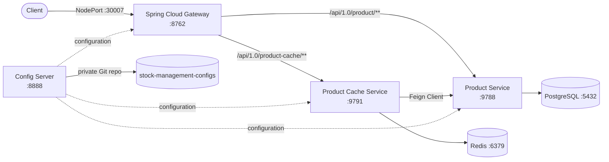

# Stock Management System

[Türkçe README için tıklayın](README.tr.md)

A microservice-based stock/inventory management system built with **Spring Boot** and **Spring Cloud**. The project demonstrates a realistic microservices architecture: centralized configuration, an API gateway, a relational-data service, and a Redis-backed caching service that talks to it over Feign — orchestrated with Docker Compose for local development and **deployed end-to-end on Kubernetes (tested on minikube)**.

## Architecture



## Services

| Service | Description | Default Port | README |
|---|---|---|---|
| [`config-server`](config-server) | Centralized configuration server (Spring Cloud Config), backed by a private Git repository | `8888` | [EN](config-server/README.md) / [TR](config-server/README.tr.md) |
| [`spring-cloud-gateway`](spring-cloud-gateway) | API gateway routing external traffic to `product-service` and `product-cache-service` | `8762` | [EN](spring-cloud-gateway/README.md) / [TR](spring-cloud-gateway/README.tr.md) |
| [`product-service`](product-service) | Core product CRUD service backed by PostgreSQL, schema managed by Flyway | `9788` | [EN](product-service/README.md) / [TR](product-service/README.tr.md) |
| [`product-cache-service`](product-cache-service) | Read-through cache in front of `product-service`, backed by Redis | `9791` | [EN](product-cache-service/README.md) / [TR](product-cache-service/README.tr.md) |

Additional folders:
- [`configs`](configs) — Spring Cloud Config profile files (`localhost`, `stage`, `k8s`) served by the config server.
- [`deployment`](deployment) — Docker Compose stack and PostgreSQL init scripts for running everything locally.

## Tech Stack

- **Java 21**
- **Spring Boot** (3.2.x / 3.5.x depending on the service)
- **Spring Cloud** — Config Server, Gateway, OpenFeign
- **PostgreSQL 16** — persistence for `product-service`, schema versioned with **Flyway**
- **Redis 7** — caching layer for `product-cache-service`
- **Docker & Docker Compose** — local orchestration
- **Kubernetes** — every service (`config-server`, `product-service` + PostgreSQL, `product-cache-service` + Redis, `spring-cloud-gateway`) has manifests under its own `k8s/` folder and has been deployed and tested end-to-end on **minikube**
- **springdoc-openapi (Swagger UI)** — API documentation
- **Lombok**, **JPA/Hibernate**, **Maven**

## Getting Started

### Prerequisites
- Docker & Docker Compose
- JDK 21 (only needed if you want to build/run services outside Docker)
- A GitHub personal access token, since the config server pulls configuration from a private Git repository

### Run with Docker Compose

1. Create a `.env` file next to `deployment/compose.yaml` with the required variables:

```env
GITHUB_USERNAME=your-github-username
GITHUB_TOKEN=your-github-token
DB_NAME=stock_management
DB_USERNAME=postgres
DB_PASSWORD=postgres
REDIS_PASSWORD=your-redis-password
CONFIG_SERVER_URL=http://config-server:8888
```

2. From the `deployment` folder, start the stack:

```bash
cd deployment
docker compose up --build
```

3. Services will become available at:
   - Config Server → `http://localhost:8888`
   - Gateway → `http://localhost:8762`
   - Product Service → `http://localhost:9788`
   - Product Cache Service → `http://localhost:9791`
   - PostgreSQL → `localhost:5433`
   - Redis → `localhost:6379`

The startup order is enforced through Docker Compose health checks: `config-server` and `postgres`/`redis` must be healthy before the dependent services start.

### Run Locally (without Docker)

Each service can also be run individually with its `localhost` Spring profile — see each service's own README for details.

## Configuration Management

All services (except the config server itself) import their configuration from the `config-server` at startup:

```yaml
spring:
  config:
    import: "optional:configserver:http://config-server:8888"
```

The config server, in turn, pulls YAML files from a separate, private Git repository (`stock-management-configs`) — the [`configs`](configs) folder in this repo mirrors what that Git repository contains, with profile-specific sections for `localhost`, `stage`, and `k8s`.

## Kubernetes Deployment

Every service in this project has been deployed and verified end-to-end on **minikube**, including the pieces that had no manifests originally (`config-server`, Redis, `product-cache-service`).

### Images

Images are built and pushed to Docker Hub under a consistent naming convention: `elifcelik49/sm-<service>:latest` (e.g. `elifcelik49/sm-product-service:latest`), then pulled by Kubernetes rather than loaded directly into minikube's Docker daemon — mirroring how a real CI/CD pipeline (build → tag → push → `kubectl apply`) would work.

### Secrets

Three Kubernetes Secrets are required before deploying:

| Secret | Keys | Used by |
|---|---|---|
| `postgres-secret` | `database`, `username`, `password` | `postgres`, `product-service` |
| `github-secret` | `username`, `token` | `config-server` (to clone the private config repo) |
| `redis-secret` | `password` | `redis`, `product-cache-service` |

```bash
kubectl create secret generic postgres-secret \
  --from-literal=database=stock_management \
  --from-literal=username=postgres \
  --from-literal=password=postgres123

kubectl create secret generic github-secret \
  --from-literal=username=<github-username> \
  --from-literal=token=<github-personal-access-token>

kubectl create secret generic redis-secret \
  --from-literal=password=redis123
```

### Deploy order

```bash
kubectl apply -f product-service/k8s/postgres/
kubectl apply -f config-server/k8s/
kubectl apply -f product-service/k8s/product-service/
kubectl apply -f product-cache-service/k8s/redis/
kubectl apply -f product-cache-service/k8s/product-cache-service/
kubectl apply -f spring-cloud-gateway/k8s/
```

### External access

The gateway's Service is exposed as `NodePort` (`30007`). On minikube, get a reachable URL with:

```bash
minikube service spring-cloud-gateway --url
```

```bash
curl http://<minikube-url>/api/1.0/product/EN/products
curl http://<minikube-url>/api/1.0/product-cache/EN/products/1
```

### Schema management on Kubernetes

The `k8s` Spring profile uses `ddl-auto: validate` for `product-service` — Hibernate never creates or alters tables in this environment. Instead, **Flyway** owns the schema via a versioned migration (`product-service/src/main/resources/db/migration/V1__create_product_table.sql`), applied automatically on startup. See the [`product-service` README](product-service/README.md) for details.

## Notes

This project was built as a personal/learning project to practice a microservices architecture (config server, gateway, service discovery via Kubernetes DNS, Feign-based inter-service calls, caching, and Flyway-based schema management) with Spring Cloud, Docker, and Kubernetes.