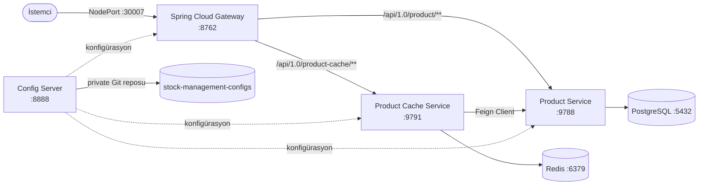
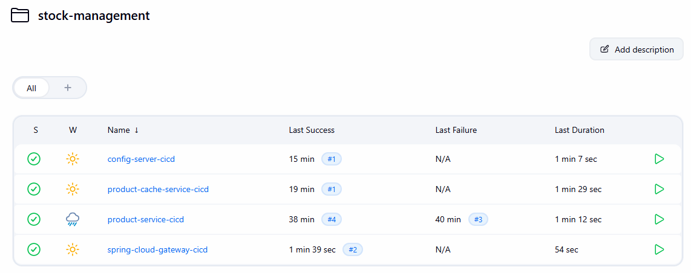

# Stock Management System (Stok Yönetim Sistemi)

[For English README click here](README.md)

**Spring Boot** ve **Spring Cloud** ile geliştirilmiş, mikroservis mimarisine sahip bir stok/envanter yönetim sistemi. Proje; merkezi konfigürasyon yönetimi, bir API gateway, ilişkisel veriye dayalı bir servis ve bu servisle Feign üzerinden haberleşen Redis destekli bir önbellekleme servisinden oluşan gerçekçi bir mikroservis mimarisini örnekler. Sistem yerelde Docker Compose ile ayağa kaldırılabilir, ve **uçtan uca Kubernetes'e (minikube üzerinde test edilmiş) deploy edilmiştir**.

## Mimari



## Servisler

| Servis | Açıklama | Varsayılan Port | README |
|---|---|---|---|
| [`config-server`](config-server) | Private bir Git deposu üzerinden beslenen, merkezi konfigürasyon servisi (Spring Cloud Config) | `8888` | [EN](config-server/README.md) / [TR](config-server/README.tr.md) |
| [`spring-cloud-gateway`](spring-cloud-gateway) | Dış trafiği `product-service` ve `product-cache-service`'e yönlendiren API gateway | `8762` | [EN](spring-cloud-gateway/README.md) / [TR](spring-cloud-gateway/README.tr.md) |
| [`product-service`](product-service) | PostgreSQL üzerinde çalışan, şeması Flyway ile yönetilen temel ürün CRUD servisi | `9788` | [EN](product-service/README.md) / [TR](product-service/README.tr.md) |
| [`product-cache-service`](product-cache-service) | `product-service` önünde, Redis destekli önbellekleme servisi | `9791` | [EN](product-cache-service/README.md) / [TR](product-cache-service/README.tr.md) |

Ek klasörler:
- [`configs`](configs) — Config server tarafından sunulan Spring Cloud Config profil dosyaları (`localhost`, `stage`, `k8s`).
- [`deployment`](deployment) — Sistemi yerelde ayağa kaldırmak için Docker Compose dosyası ve PostgreSQL init script'leri.

## Teknoloji Yığını

- **Java 21**
- **Spring Boot** (servise göre 3.2.x / 3.5.x)
- **Spring Cloud** — Config Server, Gateway, OpenFeign
- **PostgreSQL 16** — `product-service` için kalıcı veri katmanı, şeması **Flyway** ile versiyonlanır
- **Redis 7** — `product-cache-service` için önbellekleme katmanı
- **Docker & Docker Compose** — yerel orkestrasyon
- **Kubernetes** — her servisin (`config-server`, `product-service` + PostgreSQL, `product-cache-service` + Redis, `spring-cloud-gateway`) kendi `k8s/` klasöründe manifestleri var ve **minikube** üzerinde uçtan uca deploy edilip test edilmiştir
- **springdoc-openapi (Swagger UI)** — API dokümantasyonu
- **Lombok**, **JPA/Hibernate**, **Maven**

## Başlarken

### Ön Gereksinimler
- Docker & Docker Compose
- JDK 21 (yalnızca servisleri Docker dışında build edip çalıştırmak isterseniz gerekli)
- Bir GitHub personal access token, çünkü config server konfigürasyonu private bir Git deposundan çekiyor

### Docker Compose ile Çalıştırma

1. `deployment/compose.yaml` ile aynı klasöre gerekli değişkenleri içeren bir `.env` dosyası oluşturun:

```env
GITHUB_USERNAME=github-kullanici-adiniz
GITHUB_TOKEN=github-token'iniz
DB_NAME=stock_management
DB_USERNAME=postgres
DB_PASSWORD=postgres
REDIS_PASSWORD=redis-sifreniz
CONFIG_SERVER_URL=http://config-server:8888
```

2. `deployment` klasöründen sistemi başlatın:

```bash
cd deployment
docker compose up --build
```

3. Servisler şu adreslerde erişilebilir olacaktır:
   - Config Server → `http://localhost:8888`
   - Gateway → `http://localhost:8762`
   - Product Service → `http://localhost:9788`
   - Product Cache Service → `http://localhost:9791`
   - PostgreSQL → `localhost:5433`
   - Redis → `localhost:6379`

Başlangıç sırası Docker Compose health check'leri ile garanti altına alınmıştır: bağımlı servisler başlamadan önce `config-server` ile `postgres`/`redis`'in sağlıklı (healthy) olması beklenir.

### Yerelde Çalıştırma (Docker olmadan)

Her servis, kendi `localhost` Spring profiliyle tek tek de çalıştırılabilir — detaylar için her servisin kendi README dosyasına bakın.

## Konfigürasyon Yönetimi

Config server hariç tüm servisler, açılışta konfigürasyonlarını `config-server`'dan import eder:

```yaml
spring:
  config:
    import: "optional:configserver:http://config-server:8888"
```

Config server ise YAML dosyalarını ayrı, private bir Git deposundan (`stock-management-configs`) çeker — bu repodaki [`configs`](configs) klasörü, o Git deposunun içeriğini; `localhost`, `stage` ve `k8s` profillerine özel bölümleriyle birlikte yansıtır.

## Kubernetes Deployment

Bu projedeki her servis, **minikube** üzerinde uçtan uca deploy edilip doğrulanmıştır — başlangıçta hiç manifesti olmayan parçalar (`config-server`, Redis, `product-cache-service`) dahil.

### Image'lar

Image'lar, tutarlı bir isimlendirme kuralıyla (`elifcelik49/sm-<servis>:latest`, örn. `elifcelik49/sm-product-service:latest`) Docker Hub'a build edilip push edilir, ardından minikube'un Docker daemon'ına doğrudan yüklenmek yerine Kubernetes tarafından **çekilir (pull)** — gerçek bir CI/CD pipeline'ının (build → tag → push → `kubectl apply`) akışını simüler.

### Secret'lar

Deploy etmeden önce üç Kubernetes Secret'ı gereklidir:

| Secret | Key'ler | Kullanan servis |
|---|---|---|
| `postgres-secret` | `database`, `username`, `password` | `postgres`, `product-service` |
| `github-secret` | `username`, `token` | `config-server` (private config reposunu clone edebilmek için) |
| `redis-secret` | `password` | `redis`, `product-cache-service` |

```bash
kubectl create secret generic postgres-secret \
  --from-literal=database=stock_management \
  --from-literal=username=postgres \
  --from-literal=password=postgres123

kubectl create secret generic github-secret \
  --from-literal=username=<github-kullanici-adi> \
  --from-literal=token=<github-personal-access-token>

kubectl create secret generic redis-secret \
  --from-literal=password=redis123
```

### Deploy sırası

```bash
kubectl apply -f product-service/k8s/postgres/
kubectl apply -f config-server/k8s/
kubectl apply -f product-service/k8s/product-service/
kubectl apply -f product-cache-service/k8s/redis/
kubectl apply -f product-cache-service/k8s/product-cache-service/
kubectl apply -f spring-cloud-gateway/k8s/
```

### Dışarıdan erişim

Gateway'in Service'i `NodePort` (`30007`) olarak dışarıya açık. Minikube'da erişilebilir bir URL almak için:

```bash
minikube service spring-cloud-gateway --url
```

```bash
curl http://<minikube-url>/api/1.0/product/EN/products
curl http://<minikube-url>/api/1.0/product-cache/EN/products/1
```

### Kubernetes'te şema yönetimi

`k8s` Spring profili, `product-service` için `ddl-auto: validate` kullanır — Hibernate bu ortamda hiçbir zaman tablo oluşturmaz veya değiştirmez. Bunun yerine şemayı **Flyway**, versiyonlanmış bir migration dosyasıyla (`product-service/src/main/resources/db/migration/V1__create_product_table.sql`) yönetir; bu dosya uygulama her başladığında otomatik olarak uygulanır. Detaylar için [`product-service` README](product-service/README.tr.md) dosyasına bakın.

### Veri kalıcılığı

PostgreSQL, bir `emptyDir` yerine bir `PersistentVolumeClaim` (`product-service/k8s/postgres/postgres-pvc.yaml`) tarafından desteklenir; böylece pod silinip yeniden oluşturulsa bile veri kalıcı kalır — çalışan `postgres` pod'u bilerek silinerek ve Kubernetes onu yeniden zamanladıktan sonra önceden oluşturulan ürünlerin hâlâ orada olduğu doğrulanarak test edilmiştir.

## CI/CD (Jenkins)

Her servisin, başta elle yapılan build → tag → push → deploy akışını otomatikleştiren kendi declarative **Jenkinsfile**'ı (`<servis>/Jenkinsfile`) vardır:

```
Checkout (Git) → Build JAR (Maven) → Docker Build → Docker Push (Docker Hub) → kubectl rollout restart
```

- Jenkins pipeline'ları **"Pipeline script from SCM"** olarak yapılandırılmıştır; her servisin bu repodaki `Jenkinsfile`'ını işaret eder — pipeline tanımının kendisi de versiyon kontrollüdür, sadece Jenkins arayüzünde tutulmaz.
- Docker Hub kimlik bilgileri bir Jenkins credential'ı (`dockerhub-credentials`) olarak saklanır ve `credentials()` ile enjekte edilir; pipeline'a asla hardcode edilmez, Jenkins değeri console çıktısında otomatik olarak maskeler.
- Image'lar, `elifcelik49/sm-<servis>:latest` isimlendirme kuralıyla Docker Hub'a push edilir, ardından Kubernetes yeni image'ı `kubectl rollout restart deployment/<servis>` ile alır.
- Dört job'ın hepsi (`config-server-cicd`, `product-service-cicd`, `product-cache-service-cicd`, `spring-cloud-gateway-cicd`) organizasyon için bir `stock-management` Jenkins klasörü altında gruplanmıştır.



*Dört servisin pipeline'ı da `stock-management` klasörü altında başarıyla çalışıyor.*

## Notlar

Bu proje; config server, gateway, Kubernetes DNS üzerinden servis keşfi, Feign tabanlı servisler arası çağrılar, önbellekleme ve Flyway tabanlı şema yönetimi gibi mikroservis mimarisi pratiklerini Spring Cloud, Docker ve Kubernetes ile denemek amacıyla geliştirilmiş kişisel/öğrenme amaçlı bir projedir.